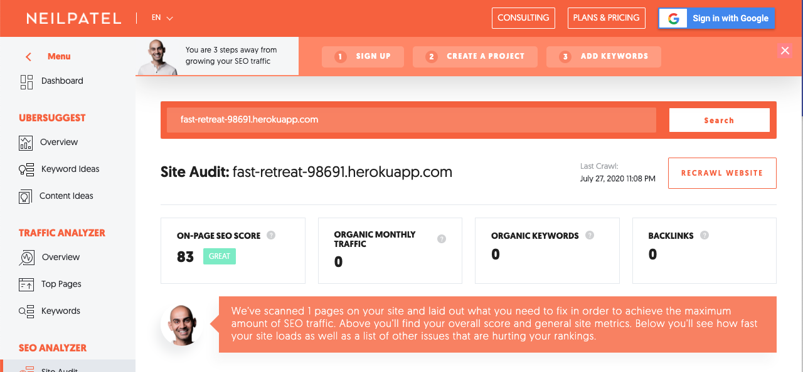
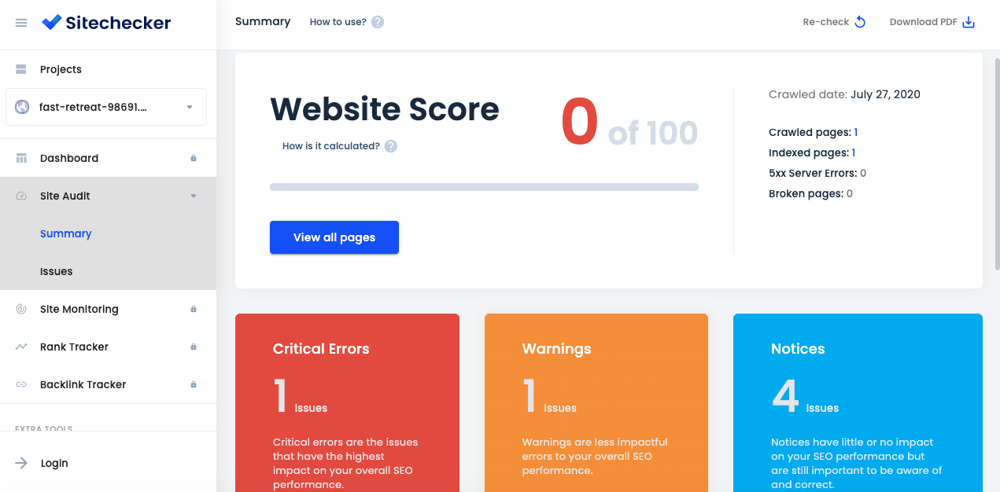

# Lab 5

## Performance Testing
### Page speed

The app scored 100 on both desktop and mobile using the PageSpeed Insights tool.

| Mobile                                                                                                        | Desktop                                                                                                       |
|---------------------------------------------------------------------------------------------------------------|---------------------------------------------------------------------------------------------------------------|
|  |  |

### SEO
The app scored 41% on the Seobility app with the following recommendations to improve that score:
* Add more internal links
* Use 301 redirects to drive traffic to URLS with the same domain and sub domain 
* Add a meta description.
* Fix errors regarding the language markup of your web page.
* Enable the compressed HTML content transfer on your server using gzip.

 
 ***
 
 The Neil Patel website annoyed me with lots of flashy popups and forced me to take an irrelevent quiz but eventually gave the app a score of 83 (great). The recommendations for improvement were:
 * Add a sitemap.xml to optimize interaction with bots
 * Add a valid SSL certificate
 * Add more words (low word count)
 
  
  ***
  
  SEO Tester Online gave the app a 61.7/100. It didn't give specific things to do in order to improve that but said the app did excellent on speed but did not do well on social or content.
   
  ***
  
  Site Checker Pro gave the app 0/100 for SEO. The suggestions for improvement were:
  * Add a description
  * Add more outgoing links
  * Add a twitter card
  * Add open graph tags
  * Make the title longer
  * Add a canonical tag
  
   
  ***
  
  SEO Site Checkup gave the app a 58/100. Suggestions for improvements included:
  * Add a meta description tag
  * Add keywords to title tag
  * add a robots.txt file
  * add a sitemap file
  * Install Google analytics
  * Add a favicon
  * Connect to social media APIs
  
   
  ***
  
  Woo Rank gave the app 33. It suggested the following in order to improve that score:
  * Add a meta description tag
  * Add 301 redirects
  * Add a robots.txt file
  * Add a xml sitemap file
  * Add schema.org items
  * Add open graph tags
  * Add twitter card tags
  * Compress and cache the css file
  * Install Google Analytics
  * Add a custom 404 page
  * Get more backlinks
  * Get more traffic
  * Get more shares on social media
  * Connect social media accounts
  
   